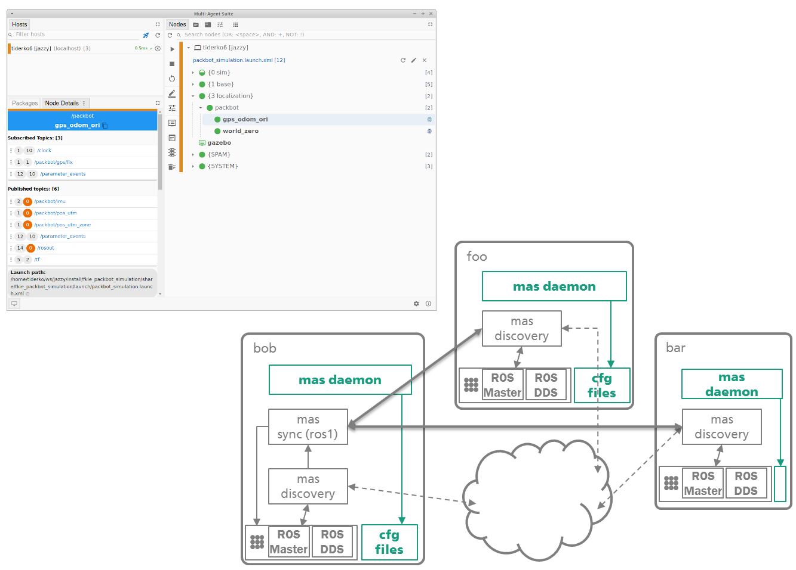

# Multi Agent Suite for ROS

Based on the [FKIE Multimaster](https://github.com/fkie/multimaster_fkie), this suite provides a collection of packages for ROS 1 and 2 for discovering, synchronizing (ROS 1), monitoring, and managing nodes on different hosts using a graphical user interface.

> The suite replaces the FKIE Multimaster!



## Install

The communication between the GUI and the Daemon (on each host) is based on WebSockets on port **35430+(ROS_DOMAIN_ID)**, 35430+255+(ROS_DOMAIN_ID)+101*(ROS_MASTER_URI_PORT-11311) with ROS1. These ports should be open in the firewall.

### Install dependencies

You need a running [TTYD](https://github.com/tsl0922/ttyd) to show screen or log output of the nodes.

```bash
sudo snap install ttyd --classic
```

> A python3-websockets version >11 is required. You can install it using pip:

```bash
pip install "websockets>=12.0"
```

> In ROS2 we use a discovery node to get host information for each ROS node. Currently the discovery node depends on the **rmw_fastrtps_cpp** ROS library. Tests must show whether it is necessary to prepend **RMW_IMPLEMENTATION=rmw_fastrtps_cpp**. Under Ubuntu 20.04 with ROS-galactic this leads to problems with the communication between discovery and daemon.

### Build ROS FKIE packages

You can run the following commands to setup a build from source:

```bash
cd ros_workspace/src
git clone https://github.com/fkie/fkie-multi-agent-suite.git fkie-multi-agent-suite
rosdep update
rosdep install -i --as-root pip:false --reinstall --from-paths fkie-multi-agent-suite
```

Then build all packages:

```bash
catkin build fkie_mas_meta
```

or

```bash
colcon build --packages-up-to fkie_mas_daemon
```

### Download GUI

```bash
curl -s https://api.github.com/repos/fkie/fkie-multi-agent-suite/releases/latest | grep "browser_download_url.*mas-gui.AppImage" | cut -d : -f 2,3 | tr -d \" | wget --show-progress -i -
chmod +x ./mas-gui.AppImage
mv ./mas-gui.AppImage ~/.local/bin/.
```

>You can find further build and start options at [fkie_mas_gui](https://github.com/fkie/fkie-multi-agent-suite/tree/master/fkie_mas_gui#readme)

## Documentation

> We are working on the documentation for the new version. Until then you can still use the old one. Apart from the package names, all old functions should be supported.

- [multimaster_fkie](http://fkie.github.io/multimaster_fkie)
- [discovery](http://fkie.github.io/multimaster_fkie/master_discovery.html) -- `discovery using multicast or zeroconf`
- [synchronization](http://fkie.github.io/multimaster_fkie/master_sync.html) -- `master synchronization`
- [Node Manager GUI](http://fkie.github.io/multimaster_fkie/node_manager.html) -- `A GUI to manage the configuration on local and remote ROS masters`
- [Node Manager daemon](http://fkie.github.io/multimaster_fkie/node_manager_daemon.html) -- `Helper node allows an easy (auto)start of remote nodes and manage remote launch files`

For ROS interfaces and parameterization see the [ROS Wiki](http://www.ros.org/wiki/multimaster_fkie). For configuration details you can find example launch files in each package.

## License

MIT © [Fraunhofer FKIE](https://www.fkie.fraunhofer.de/en.html)
