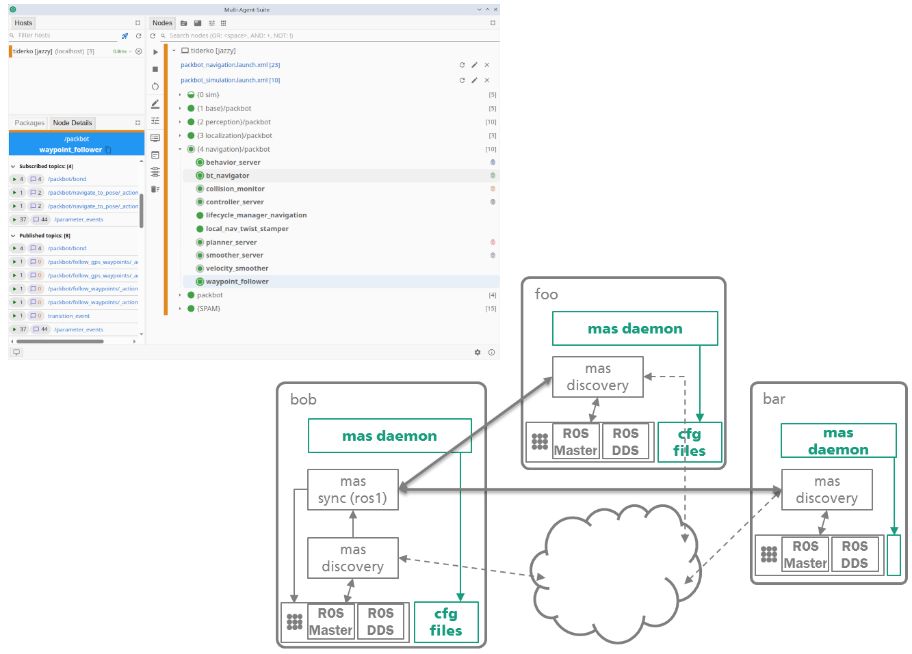

# Multi Agent Suite for ROS (MAS)

Based on the [FKIE Multimaster](https://github.com/fkie/multimaster_fkie), this suite provides a collection of packages for ROS 1 and 2 for discovering, synchronizing (ROS 1), monitoring, and managing nodes on different hosts using a graphical user interface.
This requires no or minimal configuration. The changes are automatically detected and on ROS 1 synchronized.

## Packages

**mas discovery** -- discovers other instances and additional information

**mas sync** -- Only ROS 1. Synchronize local ROS master to remote ROS masters

**mas daemon** -- Helper node allows an easy launch file management and (auto)start of {remote}nodes

**mas gui** -- A GUI to manage the configuration on local and remote ROS nodes

**mas msgs** -- ROS messages for extended MAS node interfaces

**mas pylib** -- Helper library

## Idea

- The GUI provides a complete overview of the current ROS status and allows you to configure and control it. This requires a mas daemon on each host.

- The MAS daemon collects the current ROS graph information and provides methods for managing nodes, topics, services, parameters, and startup files. MAS discovery is required to detect ROS graph changes and collect ROS node address data.

- MAS discovery
    - ROS 1: connects to the ROS-Master, gets changes by polling and publish the changes (multicast or/and unicast) over the network.
    - ROS 2: listens to ROS graph events and forwards them to the MAS daemon. In addition, host information is collected for the ROS nodes via DDS. The rmw_fastrtps_cpp ROS library is used for this purpose.

- MAS sync (ROS 1 only) connects to the discovered mas discovery nodes, requests the actual ROS state and registers the remote topics/service by local ROS master.

